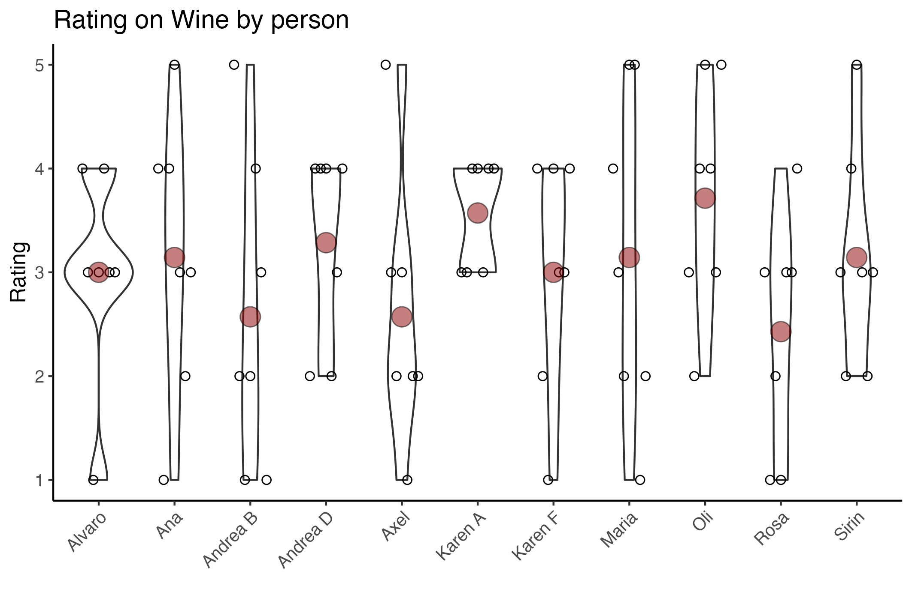
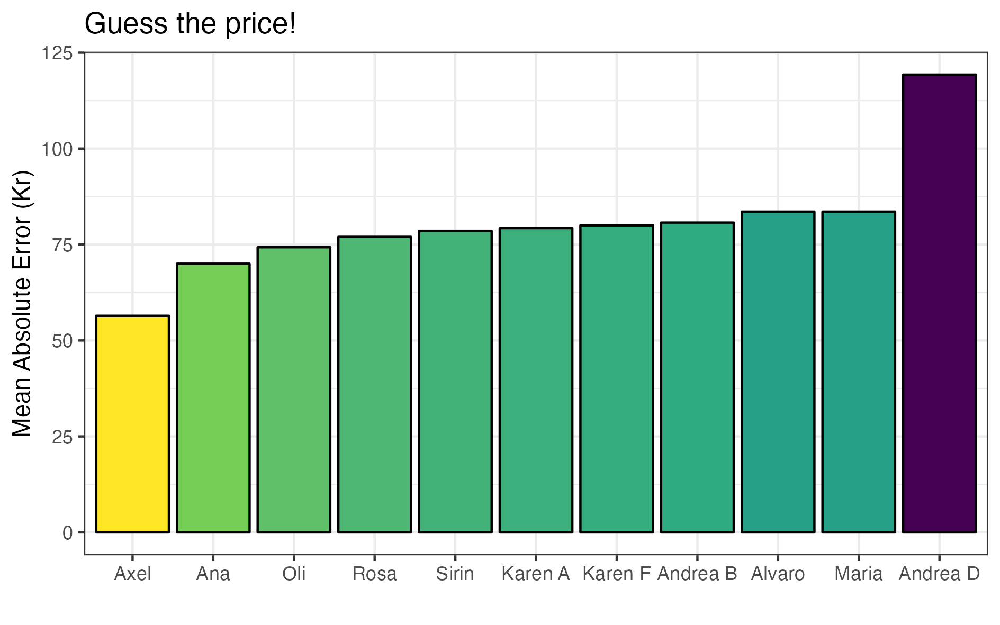
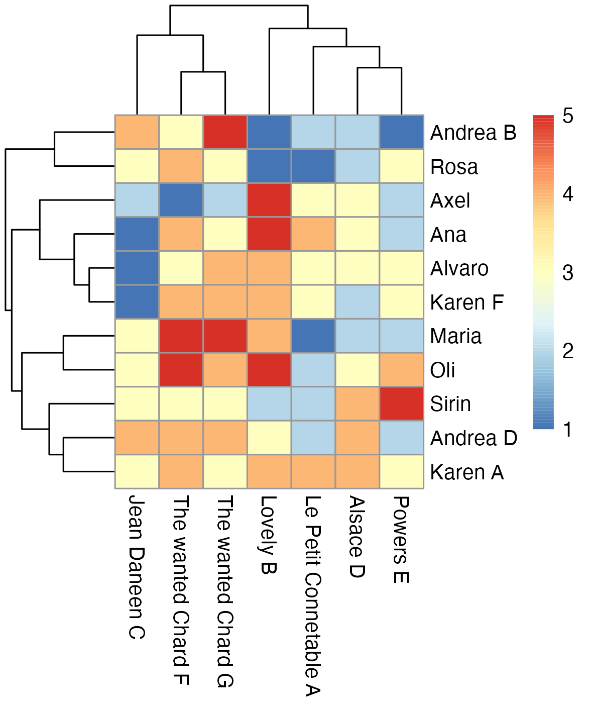

```{r setup, include=FALSE, echo=FALSE,message=FALSE, warning=FALSE}
knitr::opts_chunk$set(echo = FALSE, message = FALSE, warning = FALSE)
```

```{r}
library(tidyverse)
library("RColorBrewer")
```

## Le bottiglie in gara:
```{r, echo=FALSE, out.width = '100%'}
knitr::include_graphics("wineinfo.png")
```

## Le identical bottles
The letter shows which description you assigned to the 2 identical bottles, and the y-axis how much you rated them.
Seems like Andrea D and Karen F matched them right. Nobody matched them to the right description.

```{r paired_wines_rating, echo=FALSE, out.width = '100%'}
knitr::include_graphics("plots/paired_wines_rating2.png")
```

## The best wine
The red dot shows the mean rating. The Wanted Chard was the most liked one.

```{r vino_rating_bottle, echo=FALSE, out.width = '100%'}
knitr::include_graphics("plots/Wine_rating_bottle.png")
```


Some enjoyed all wines


Seems like the more we spent on wine the less we liked them

```{r convenienza, echo=FALSE, out.width = '50%'}
knitr::include_graphics("plots/pricecorrplot.png")
```


Qua il punto rosso indica il grado alcolico effettivo

```{r ethobywine, echo=FALSE, out.width = '100%'}
knitr::include_graphics("plots/ethobywine.png")
```

## A chi piace bere

```{r rating_per_sommelier, echo=FALSE, out.width = '100%'}

```

## La gara dell'asta

Le regole:
ricevi punti uguali al costo di ciascuna bottiglie per la quale hai offerto una cifra uguale o maggiore al suo prezzo (0 punti se hai offerto di meno).

```{r auction_rank, echo=FALSE, out.width = '100%'}

```

## Clustering
Questa é una heatmap. Il giudizio su ciascuna bottiglia é indicato dal colore (Rosso = giudizio alto, blue = giudizio basso). Il vino giudicato é indicato sull'asse orizzontale, e chi ha dato il giudizio sull'asse verticale.

Gli alberelli ai lati sono due dendogrammi che indicano la 'similaritá' tra vini e tra persone che emerge dai giudizi dati. La similaritá (misurata dalla distanza geometrica) tra due vini (o persone) si legge dall'altezza della linea orizzonatale che li congiunge. 

Per esempio Fede e Ele sono la coppia con i gusti piú simili. Se dovessero decidere di andare a bere insieme e invitare una tersa persona, inviterebbero Maria, che ha i gusti piu simili a loro. 

```{r heatmap, echo=FALSE, out.width = '100%'}

```