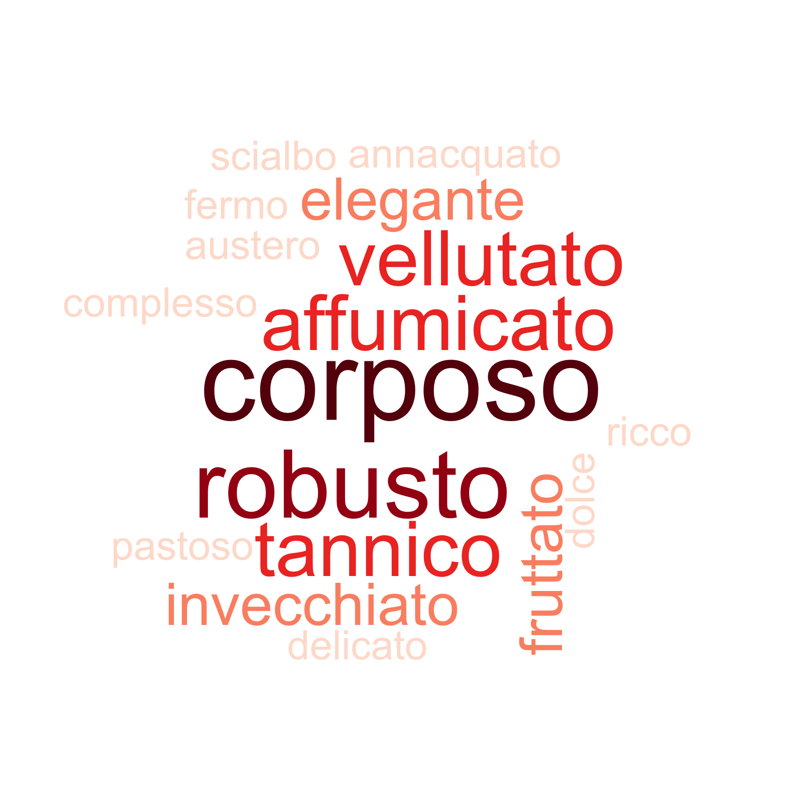

```{r setup, include=FALSE, echo=FALSE,message=FALSE, warning=FALSE}
knitr::opts_chunk$set(echo = FALSE, message = FALSE, warning = FALSE)
```


```{r}
library(tidyverse)
library("RColorBrewer")

rating_raw <- readxl::read_xlsx("wine_rating.xlsx", "rating")
sommeliers <- readxl::read_xlsx("wine_rating.xlsx", "sommeliers")
labels <- readxl::read_xlsx("wine_rating.xlsx", "labels")

rating <- rating_raw %>%
  mutate(other = str_split(other, ",")) %>%
  unnest(other) %>%
  mutate(other= case_when(is.na(other) ~ "noother",
                          T~other),
           is_other = case_when(!is.na(other)~"1")) %>%
  spread(other, is_other) %>%
  select(-noother) %>%
  left_join(labels) %>%
  left_join(sommeliers)

```


In genere, siamo convinti che il vino piú costa piú ci piacerá (figura a sinistra).
In questo caso i dati confermano un pó questa convinzione: c'é una correlazione tra il vero prezzo e il giudizio dato sul vino (figura a destra).

```{r, fig.width=6, fig.height=4}
costpay1 <- rating %>%
  ggplot(aes(y=pay, x=grade)) +
  geom_boxplot(aes(group=grade)) +
  geom_point(shape=21, size=3, position = position_dodge2(width = .5)) +
  theme_classic() +
  labs(y="Quanto credi che costa", x="quanto ti piace") +
  geom_smooth(method="lm", col="gray", linetype="dashed", se=F)

costpay2 <- rating %>%
  ggplot(aes(y=price, x=grade)) +
  geom_boxplot(aes(group=grade)) +
  geom_point(shape=21, size=3, position = position_dodge2(width = .5)) +
  theme_classic() +
  labs(y="Quanto veramente costa", x="quanto ti piace")+
  geom_smooth(method="lm", col="gray", linetype="dashed", se=F)

ggpubr::ggarrange(plotlist = list(A=costpay1, B=costpay2), 
                  common.legend = T)

```

## Indovina il prezzo!

Chi é stato il migliore a indovinare il prezzo del vino?

Il punteggio é determinato dalla media degli scarti tra il prezzo reale e quello indovinato (cioé vince chi ha fatto meno punti)

```{r, fig.width=6, fig.height=4}
priceguess_rank <- rating %>% 
  mutate(diff = abs(pay - price),
         Nome=name)  %>% 
  group_by(Nome) %>% 
  summarise(Punteggio = mean(diff)) %>% 
  arrange(Punteggio)

priceguess_rank %>% 
  ggplot(aes(x=reorder(Nome, Punteggio), y=Punteggio)) +
  geom_col(aes(fill=Punteggio), col="black", show.legend = F) +
  theme_bw() +
  scale_fill_continuous(type = "viridis", trans = 'reverse') +
  labs(x="") +
  ggtitle("Indovina il prezzo!")

```

Ogni vino viene percipito piú o meno forte, giustamente, ma ognuno traduce il grado percepito con una scala diversa.

(I puntini rossi indicano il valore reale)

```{r, fig.width=6, fig.height=4}
ethobyname <- rating %>%
  select(name, etoh, pay) %>%
  ggplot(aes(x=name, y=etoh)) +
  geom_violin() +
  geom_point(size=2, shape=21, position= position_dodge2(width = 0.5)) +
  theme_classic() +
  theme(axis.text.x = element_text(angle=45, hjust=1)) +
  ggtitle("Grado alcolico percepito per sommelier") +
  labs(y="Grado alcolico percepito", x="")

ethobyname
```

```{r, fig.width=6, fig.height=4}
ethobywine <- rating %>%
  select(wine_name, etoh, pay) %>%
  ggplot(aes(x=wine_name, y=etoh)) +
  geom_violin() +
  geom_point(size=2, shape=21, position= position_dodge2(width = 0.5)) +
  theme_classic()+
  theme(axis.text.x = element_text(angle=45, hjust=1)) +
  geom_point(data= labels, col="red", aes(x=wine_name, y=EtOH)) +
  ggtitle("Grado alcolico percepito per vino") +
  labs(y="Grado alcolico percepito", x="")


ethobywine
```

## Indovina il grado alcolico!

La stessa cosa di prima, sul grado alcolico.
(C'é chi non ci ha nemmeno provato su tutti i vini ed é stato escluso)

```{r, fig.width=6, fig.height=4}
ehohguess_rank <- rating %>% 
  transmute(diff = abs(etoh - EtOH),
         Nome=name) %>%
  group_by(Nome) %>% 
  summarise(Punteggio = mean(diff)) %>% 
  arrange(Punteggio) %>% 
  filter(!is.na(Punteggio))

ehohguess_rank %>% 
  ggplot(aes(x=reorder(Nome, Punteggio), y=Punteggio)) +
  geom_col(aes(fill=Punteggio), col="black", show.legend = F) +
  theme_bw() +
  scale_fill_continuous(type = "viridis", trans = 'reverse') +
  labs(x="") +
  ggtitle("Indovina il grado alcolico!")
```

## Classifica dei vini 

Come sono state apprezzate le bottiglie in gara?

I quadratini rossi indicano il giudizio medio.

```{r, fig.width=6, fig.height=4}
rating %>%
  ggplot(aes(y=grade, x= reorder(paste(wine_name, label), wine_name))) +
  geom_violin() +
  geom_point(position=position_dodge2(width=.2), shape=21, alpha=.5, col="black", size=2) +
  geom_point(size=2,shape=23, stat="summary", fill="red") +
  theme_classic() +
  theme(axis.text.x = element_text(angle=45, hjust=1, vjust=1),
        text=element_text(size=12)) +
  xlab("") + ylab("rating") +
  ggtitle("Giudizi sul vino per bottiglia")
```


```{r, eval=FALSE}
# work clouds for wine descriptions
description_words <- c("fruttato", "secco", "corposo", "tannico", "affumicato", 
                       "elegante", "delicato", "dolce", "pastoso", "invecchiato", "amabile", 
                       "amaro", "complesso", "ricco", "piccante", "robusto", "fermo", 
                       "aspro", "vellutato", "acido", "austero", "speziato", " annacquato", 
                       "frizzante", "malissimo", "merda", "morbido", "scialbo")

description_df <- rating %>%
  select(name, wine_name,label, all_of(description_words)) %>%
  gather(adjective, value, all_of(description_words)) %>%
  filter(!is.na(value)) %>%
  select(-value)

for (labelx in unique(description_df$label)) {
  description_by_wine <- description_df %>%
    filter(label==labelx) %>%
    group_by(adjective) %>%
    summarise(n=n()) %>% ungroup() %>%
    mutate(freq=n/sum(n))

  png(paste0("plots/wc_",labelx,".png"), width = 15, height = 15, units = "cm", res=300)
  
  wordcloud::wordcloud(words = description_by_wine$adjective, 
                       freq = description_by_wine$n, 
                       min.freq = 0, 
                       random.order=F,
                       random.color =F,
                       max.words =50,
                       scale = c(5,1),
                       rot.per = 0.35,
                       colors=brewer.pal(9, "Reds"),
                       ordered.colors =F)
  
  dev.off()
}
```


```{r}
winner_wine <- rating %>% 
  group_by(wine_name) %>% 
  summarise(grade=mean(grade)) %>% 
  arrange(desc(grade)) %>% 
  slice(1) %>% 
  pull(wine_name)

```

## Il vincitore: `r winner_wine`` 

Descritto dai nostri sommeliers come




Il prossimo grafico invece illustra come ognuno é stato piú o meno largo di giudizi. C'é chi apprezza tutto, chi non si sbilancia mai, chi non giudica mai troppo duramente, ecc.

```{r, fig.width=6, fig.height=4}
rating %>%
  ggplot(aes(y=grade, x= name)) +
  geom_violin(trim = T, scale = "count") +
  geom_point(position=position_dodge2(width=.5), 
             size=3, shape=21,alpha=.5, 
             aes(fill = wine_name), stat="identity") +
  geom_point(size=2, stat="summary", fill="red", shape=23, stroke=1) +
  theme_classic() +
  theme(axis.text.x = element_text(angle=45, hjust=1, vjust=1),
        text=element_text(size=12)) +
  labs(x="", y="Giudizio") +
  ggtitle("Giudizi sul vino per sommelier")
```

## Indivona il doppione!

Chi é riuscito a indovinare i due vini identici? E chi invece li ha giudicati come completamente diversi?

```{r, fig.width=6, fig.height=4}
rating %>%
  filter(label %in% c("A","D")) %>% 
  group_by(name) %>% 
  summarise(min=min(grade), max=max(grade)) %>% 
  ggplot(aes(x= reorder(name, abs(min-max)))) +
  geom_segment(aes(y=min, yend=max, xend=name), size=2) +
  geom_point(aes(y=min),
             size=3, stat="identity") +
  geom_point(aes(y=max),
             size=3, stat="identity") +
  theme_bw() +
  theme(axis.text.x = element_text(angle=45, hjust=1, vjust=1),
        text=element_text(size=12)) +
  labs(y="Giduzio", x="") +
  ggtitle("Giudizio sulle bottiglie identiche") +
  scale_y_continuous(limits = c(1,5))
```

## Similaritá tra vini e tra sommeliers

Due vini possoso assomigliarsi, e allo stesso modo i gusti tra due persone.

Queste simiglianze possono essere visualizzate, cosí:

```{r, fig.width=6, fig.height=4}
rating %>%
  select(name,label,grade, wine_name) %>%
  unite(wine_name, wine_name, label, sep= " ") %>%
  spread(wine_name, grade) %>%
  column_to_rownames("name") %>%
  as.matrix() %>% t() %>%
  scale(center = F, scale = F) %>%
  pheatmap::pheatmap()
```


```{r, eval=F}
## Altre analisi poco interessanti

# people ratings over time
rating %>%
  ggplot(aes(x=order, y=grade)) +
  geom_jitter(shape=21, size=3) +
  theme_classic() +
  scale_x_continuous(breaks = unique(rating$order %>% na.omit())) +
  ggtitle("it doesn´t get better with drinking") +
  geom_smooth(method="lm", col="gray", linetype="dashed", se=F)
```