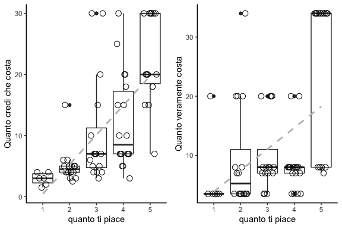
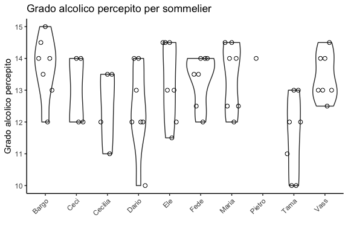
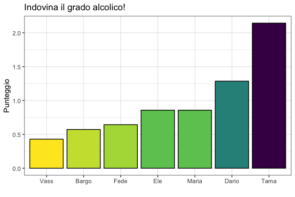
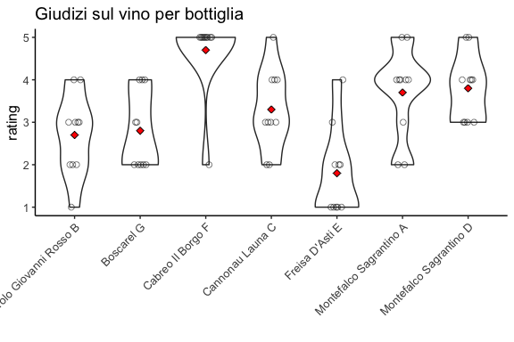
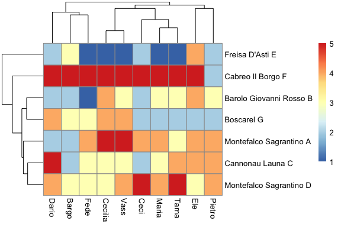

Xmas Wine Testing
================

In genere, siamo convinti che il vino piú costa piú ci piacerá (figura a
sinistra). In questo caso i dati confermano un pó questa convinzione:
c’é una correlazione tra il vero prezzo e il giudizio dato sul vino
(figura a destra).

<!-- -->

## Indovina il prezzo!

Chi é stato il migliore a indovinare il prezzo del vino?

Il punteggio é determinato dalla media degli scarti tra il prezzo reale
e quello indovinato (cioé vince chi ha fatto meno punti)

<!-- -->

Ogni vino viene percipito piú o meno forte, giustamente, ma ognuno
traduce il grado percepito con una scala diversa.

(I puntini rossi indicano il valore reale)

<!-- -->

<!-- -->

## Indovina il grado alcolico!

La stessa cosa di prima, sul grado alcolico. (C’é chi non ci ha nemmeno
provato su tutti i vini ed é stato escluso)

<!-- -->

## Classifica dei vini

Come sono state apprezzate le bottiglie in gara?

I quadratini rossi indicano il giudizio medio.

<!-- -->

## Il vincitore: Cabreo Il Borgo\`

Descritto dai nostri sommeliers come

Il prossimo grafico invece illustra come ognuno é stato piú o meno largo
di giudizi. C’é chi apprezza tutto, chi non si sbilancia mai, chi non
giudica mai troppo duramente, ecc.

<!-- -->

## Indivona il doppione!

Chi é riuscito a indovinare i due vini identici? E chi invece li ha
giudicati come completamente diversi?

<!-- -->

## Similaritá tra vini e tra sommeliers

Due vini possoso assomigliarsi, e allo stesso modo i gusti tra due
persone.

Queste simiglianze possono essere visualizzate, cosí:

<!-- -->
