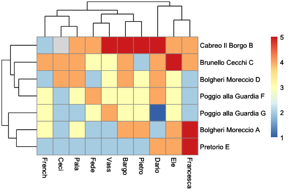

Xmas Wine Testing
================

## Correlazione tra prezzo e giudizio sul vino

<!-- -->

## Gara all’asta

<!-- -->

## Grado alcolico percepito

<!-- -->

<!-- -->

## Indovina il grado alcolico!

<!-- -->

## Classifica dei vini

<!-- -->

## Il vincitore: Brunello Cecchi\`

<!-- -->

## Indivona il doppione

<!-- -->

## Similaritá tra vini e tra sommeliers

<!-- -->

## other stuff
