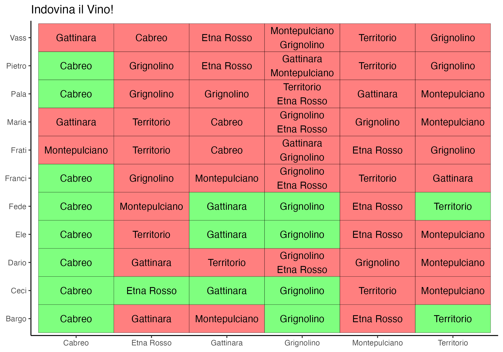
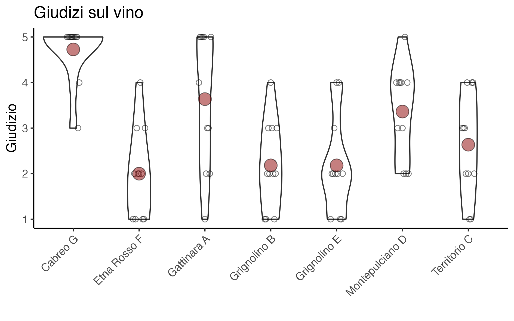
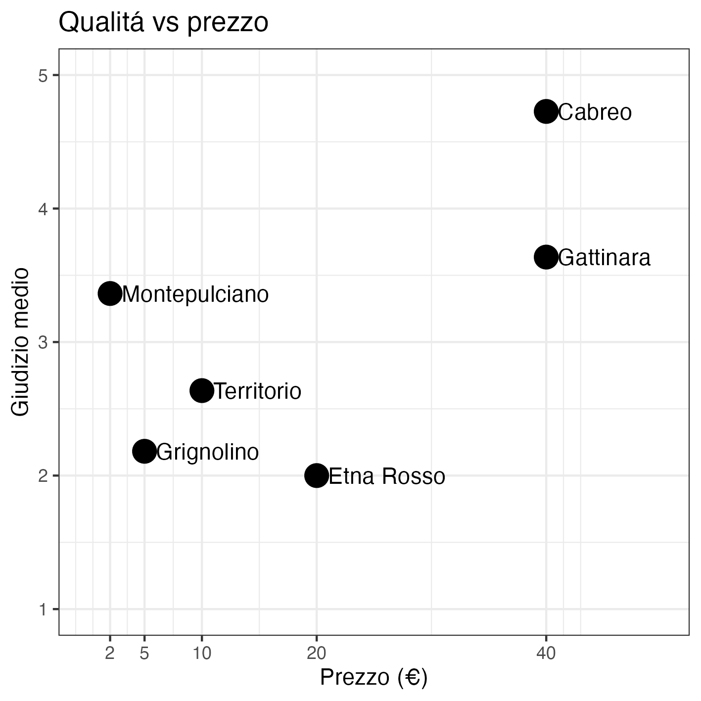
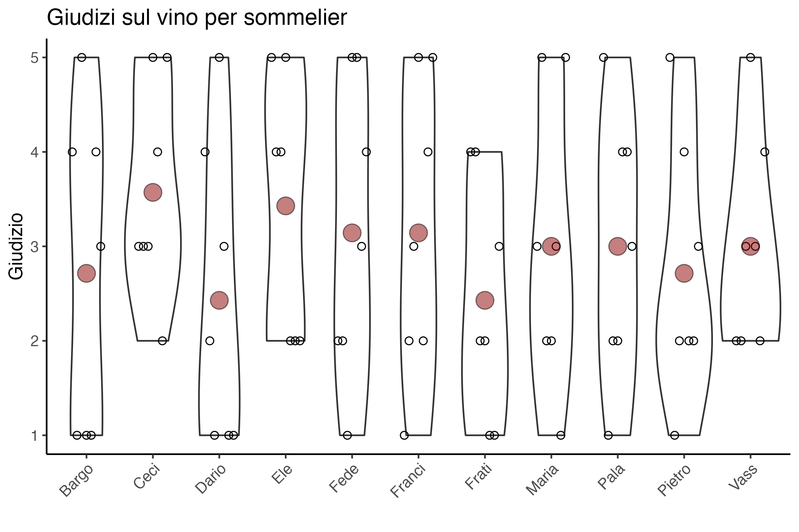

```{r setup, include=FALSE, echo=FALSE,message=FALSE, warning=FALSE}
knitr::opts_chunk$set(echo = FALSE, message = FALSE, warning = FALSE)
```

```{r}
library(tidyverse)
library("RColorBrewer")

wine_info = read_csv("WineInfo.csv") %>% 
  rename(Vino = Nome2,
         NomeCompleto = Nome) %>% 
  mutate(Bottiglia = paste(Vino,Lettera))
wine_ratings = read_csv("WineRatings.csv") %>% 
  rename(Lettera=Vino,
         Giudizio=Voto,
         GiudizioGradazione=Gradazione)
wine_guesses = read_csv("WineGuesses.csv") %>% 
  gather(Vino, Lettera, -1) %>% 
  mutate(Vino = str_remove(Vino, "[12]$"))

results = wine_ratings %>% 
  left_join(wine_info,by = join_by(Lettera))
```

## Le bottiglie in gara:
```{r, echo=FALSE, out.width = '100%'}
knitr::include_graphics("wineinfo.png")
```


## Indovina la bottiglia

```{r indovinaVino, echo=FALSE, out.width = '100%'}

```

## Le bottiglie uguali
Qualcuno non é riuscito a riconoscere le bottiglie identiche e ha giudicato una meglio dell'altra:

```{r paired_wines_rating, echo=FALSE, out.width = '100%'}
knitr::include_graphics("plots/paired_wines_rating.png")
```

## Il miglior vino di quest'anno
Il punto rosso indica il giudizio medio.

```{r vino_rating_bottle, echo=FALSE, out.width = '100%'}

```

Si puo bere bene anche spendendo poco:

```{r convenienza, echo=FALSE, out.width = '50%'}

```


Qua il punto rosso indica il grado alcolico effettivo

```{r ethobywine, echo=FALSE, out.width = '100%'}
knitr::include_graphics("plots/ethobywine.png")
```

## A chi piace bere

```{r rating_per_sommelier, echo=FALSE, out.width = '100%'}

```

## La gara dell'asta

Le regole:
ricevi punti uguali al costo di ciascuna bottiglie per la quale hai offerto una cifra uguale o maggiore al suo prezzo (0 punti se hai offerto di meno).

```{r auction_rank, echo=FALSE, out.width = '100%'}
knitr::include_graphics("plots/auction_rank.png")
```

## Clustering
Questa é una heatmap. Il giudizio su ciascuna bottiglia é indicato dal colore (Rosso = giudizio alto, blue = giudizio basso). Il vino giudicato é indicato sull'asse orizzontale, e chi ha dato il giudizio sull'asse verticale.

Gli alberelli ai lati sono due dendogrammi che indicano la 'similaritá' tra vini e tra persone che emerge dai giudizi dati. La similaritá (misurata dalla distanza geometrica) tra due vini (o persone) si legge dall'altezza della linea orizzonatale che li congiunge. 

Per esempio Fede e Ele sono la coppia con i gusti piú simili. Se dovessero decidere di andare a bere insieme e invitare una tersa persona, inviterebbero Maria, che ha i gusti piu simili a loro. 

```{r heatmap, echo=FALSE, out.width = '100%'}
knitr::include_graphics("plots/heatmap.png")
```