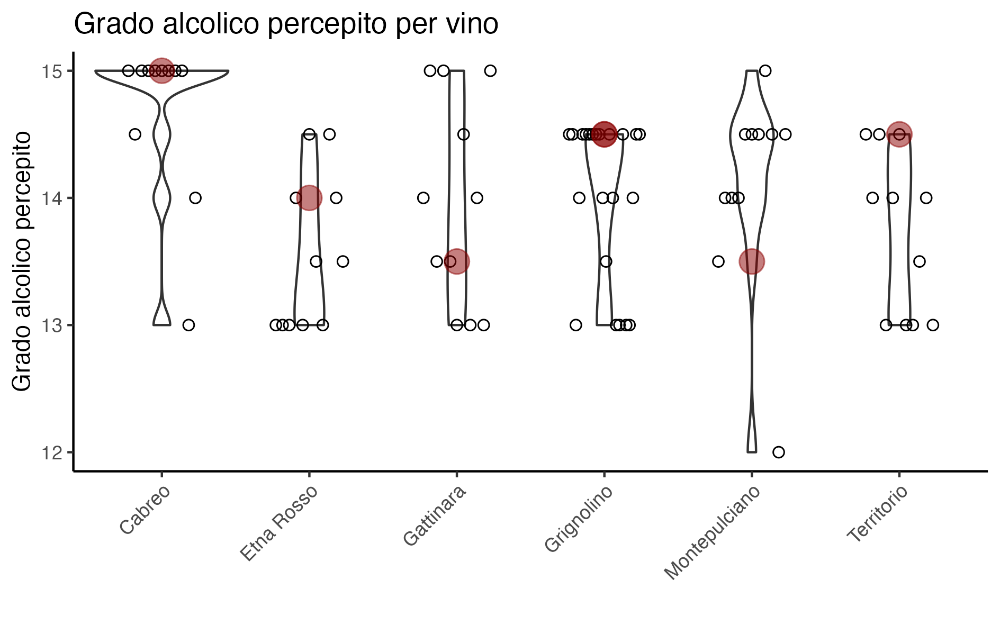
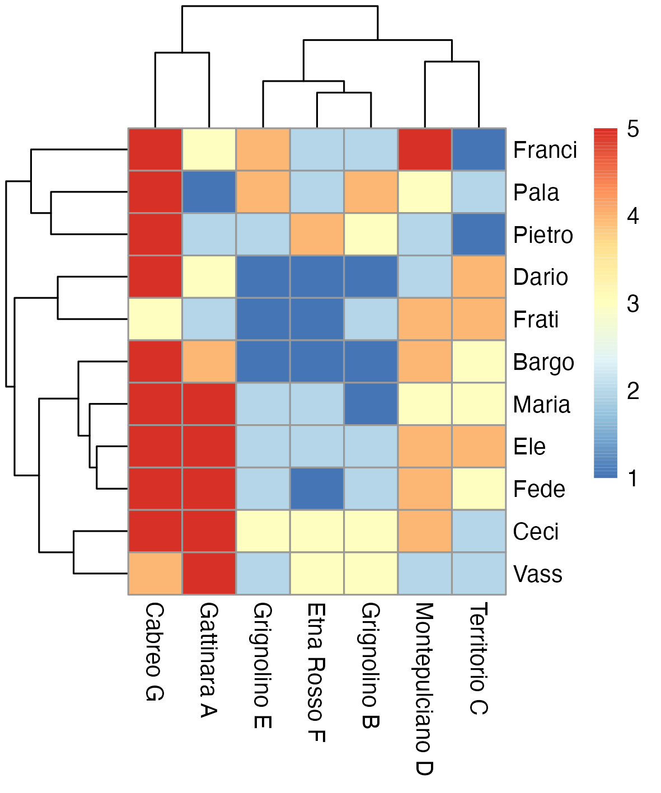

Wine Blind Tasting Xmas 2023
================

## Le bottiglie in gara:

## Indovina la bottiglia

## Le bottiglie uguali

Qualcuno non é riuscito a riconoscere le bottiglie identiche e ha
giudicato una meglio dell’altra:

## Il miglior vino di quest’anno

Il punto rosso indica il giudizio medio.

Si puo bere bene anche spendendo poco:

Qua il punto rosso indica il grado alcolico effettivo

## A chi piace bere

## La gara dell’asta

Le regole: ricevi punti uguali al costo di ciascuna bottiglie per la
quale hai offerto una cifra uguale o maggiore al suo prezzo (0 punti se
hai offerto di meno).

## Clustering

Questa é una heatmap. Il giudizio su ciascuna bottiglia é indicato dal
colore (Rosso = giudizio alto, blue = giudizio basso). Il vino giudicato
é indicato sull’asse orizzontale, e chi ha dato il giudizio sull’asse
verticale.

Gli alberelli ai lati sono due dendogrammi che indicano la ‘similaritá’
tra vini e tra persone che emerge dai giudizi dati. La similaritá
(misurata dalla distanza geometrica) tra due vini (o persone) si legge
dall’altezza della linea orizzonatale che li congiunge.

Per esempio Fede e Ele sono la coppia con i gusti piú simili. Se
dovessero decidere di andare a bere insieme e invitare una tersa
persona, inviterebbero Maria, che ha i gusti piu simili a loro.

